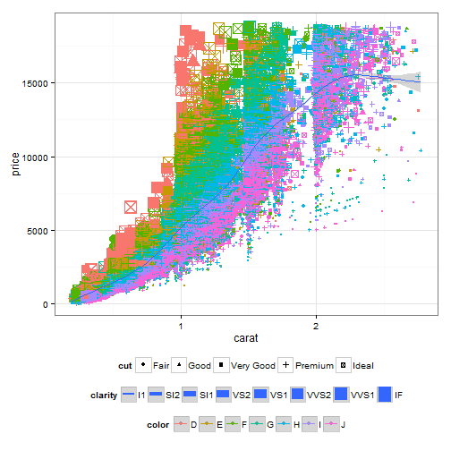

Diamond Researcher 
========================================================
## Preparing for Your Engagement Ring Purchase

author: Hayes Williams

date: Sun Jun 14 12:42:59 2015

What and Why?
========================================================

## Diamond Researcher App
Selecting an engagement ring is a difficult process.  Multiple terms like
carat, cut, color and clarity are thrown around with abandon but all of that
translates into a price out of your pocket.  

Explore the relationships between these attributes using our 50,000+ diamond
data set _before_ walking into the store so you're able to make more informed 
decisions and get the most for your money.

Diamond Researcher App Location: 
  [https://williamshayes.shinyapps.io/09-DataProducts]
  (https://williamshayes.shinyapps.io/09-DataProducts)

How Do You Use It?
========================================================
* Characteristics of diamonds (Carat, Cut, Color, Quality) are listed with all
possible values

* Move the slider for Carat or subselect the values for
each of the other three variables

* With each update, the plot, fit line and total number of diamonds will update

* Other notes:
    + If zero diamonds are selected, a warning msg is shown
    + Prices are shown in US dollars
    + Variables are shown with "least desirable" at the top, e.g., `J` 
       is the "least desirable" color

What Does the Data Look Like?
========================================================

When graphed, the data set looks like:
 

Note: Only `carat<=2.77` is included for simplicity.

Where is the Data From?
========================================================
The dataset is included in the `ggplot2` package and includes prices of 50,000+ 
round cut diamonds. Each diamond contains the prices and attributes including:

* `price`: price in US dollars (\$326-\$18,823)

* `carat`: weight of the diamond (0.2-5.01)

* `cut`: cut quality (Fair, Good, Very Good, Premium, Ideal)

* `color`: diamond color, from J (worst) to D (best)

* `clarity`: diamond clearness (I1 (worst), SI1, SI2, VS1, VS2, VVS1, VVS2, 
IF (best))
